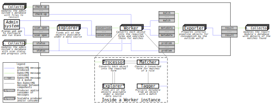
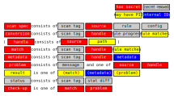

# Pipeline architecture

The `os2datascanner.engine2.pipeline` module contains the `engine2` pipeline,
also known as the _scanner engine_.

## What components make up the pipeline?

The pipeline implementation consists of five stages:

* the Explorer, which consumes a *source* message, explores all of the objects
  in that source, and produces potentially many *conversion* or *problem*
  messages;
* the Processor, which consumes a *conversion* message, converts an object into
  the appropriate form for a rule to be applied to it, and produces precisely
  one *representation* message, *problem* message, or *source* message;
* the Matcher, which consumes a *representation* message, attempts to match a
  rule against a representation of an object, and produces potentially many
  *match* messages and at most one *handle* message;
* the Tagger, which consumes a *handle* message, extracts useful metadata from
  the object that it references, and produces a *metadata* message; and
* the Exporter, which consumes *match*, *problem* and *metadata* messages and
  produces *result* messages suitable for the outside world.

To improve cache efficiency, and to reduce the amount of potentially sensitive
information transmitted over the underlying RabbitMQ message bus, the
Processor, Matcher and Tagger stages are customarily bundled into a single
process known as the _worker_.

## What are the pipeline's design principles?

* Simple external interfaces

  The pipeline should expose a clear API for getting instructions into the
  pipeline and results out of it; interacting with the pipeline in any other
  way should not be supported.

* Always in motion

  The pipeline (as a whole) should never wait. Individual instances of stages
  might wait for any number of reasons, but they shouldn't slow down the rest
  of the pipeline.

* High tolerance

  Provided that an AMQP message contains valid JSON, a stage should accept it
  immediately. Problems with handling the message should be presented as
  *problem* messages rather than raising an exception.

* Unambiguous results

  It should be possible, from the output of the pipeline, to distinguish
  between an object that didn't match a rule and an object that hasn't been
  examined yet. Objects in transit through the pipeline shouldn't just
  disappear.

* Trivial stage implementations

  Stages should be short and readable and should perform a single simple task.
  For example, the Tagger was added as a separate stage instead of giving the
  Matcher responsibility for metadata extraction.

* No unnecessary work

  Objects should skip over pipeline stages as soon as it's clear that it's
  possible.

* Clear security boundaries

  As many stages will be dealing with privileged authentication details and
  sensitive information, each stage should have clear security boundaries. To
  the extent that this is possible, a stage should be capable of being run as
  an unprivileged user with no network access in a read-only filesystem.

  Adding a new stage should be preferred to extending the security boundaries
  of an existing stage; this was another reason why Tagger, which requires
  access to content and metadata, was added instead of extending Matcher,
  which requires neither of these things.

* State is bad

  Stages should read JSON-formatted messages from AMQP queues, perform some
  appropriate work, and then write JSON-formatted messages to AMQP queues. No
  stage should maintain any internal (apart from trivial caching) or external
  state.

  In particular, this means that pipeline stages should not communicate with a
  database: their tasks should be precisely and exclusively specified by their
  input.
