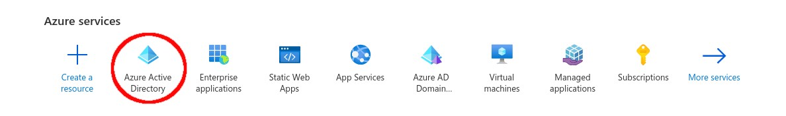

# Opsætning af Applikation i Azure

Login på Microsoft Azure portal via [https://portal.azure.com/#home](https://portal.azure.com/#home) og vælg Azure Active Directory.

Fra Azure Active Directory menuen i venstre side skal du vælge App Registration.

Herefter skal du vælge "New registration".

Giv den nye app et sigende navn, vælg "Single tenant" under "Supported account types" og indtast
følgende redirect URI: `https://DIN_KOMMUNES_NAVN-admin.os2datascanner.dk/msgraphmailscanners/add/`

Når du har udyldt ovenstående skal du klikke på "Register".

Nu har du registreret en ny app, og du skulle gerne se en oversigt over den nye app.

Application ID skal kopieres og sendes til Magenta ApS.

Hvis i også ønsker at scanne Onedrive skal i tilføje en redirect URI mere.
Det gøres ved at klikke på menu punktet i venstre side kaldet "Authentication".
Klik herefter på "Add URI" og indsæt følgende redirect URI: `https://DIN_KOMMUNES_NAVNadmin.os2datascanner.dk/msgraph-filescanners/add/` og tryk tilsidst på "Save".

For at OS2datascanner kan scanne emails og filer i Azure via den oprettet App, skalder genereres en Client secret. Det gøres via menupunktet "Certificates & secrets".

Klik nu på "New client secret", indtast en beskrivelse, sæt en fornuftig udløbsdato og klik tilsidst på "Add". Notér udløbsdatoen og send den til Magenta ApS.

Kopier nu Client secret værdien, markeret på billedet med rød cirkel ovenfor, ved at klikke på Kopier ikonet lige ved siden af. Gem værdien et sikkert sted og send en kopi til Magenta ApS.

Til sidst skal vi have givet vores App, API rettigheder. Det gøres ved at klikke på menupunktet "API permissions" og herefter "Add a permission".

Der vil nu dukke en menu op i højre side af skærmen, og her skal du klikke på "Microsoft Graph"
menuen.

Herefter skal du klikke på "Application permissions".

Her skal du så fremsøge og vælge følgende permissions:

* Directory.Read.All
* Files.Read.All
* Mail.Read
* Notes.Read.All
* Sites.Read.All
* User.Read

Når alle permissions er fundet og tilføjet skal det se således ud:

Når Magenta har tilføjet Client Secret og Application ID til jeres OS2datascanner installation kan i begynde og tilføje Office365 scannerjobs.

# Oprettelse af Office 365 scannerjobs

OS2datascanner gør det muligt at scanne i Office 365 email kontis. Hvis fanen "Office 365 mailscanner" er synlig kan man tilføje et nyt scannerjob ved at klikke på "Tilføj nyt" knappen.

Hvis der ikke er oprettet andre Office 365 scannerjobs skal du via Microsoft Online (Office 365) give OS2datascanner lov til at tilgå organisationens data. Dette gøres ved at klikke på "Fortsæt til Microsoft Online" knappen.

Du vil nu blive bedt om at logge ind via Microsoft online. Hvis ikke din Microsoft bruger
allerede er logget ind vil du blive om at indtaste password. Brugeren du logger ind med skal have de fornødne rettigheder til [den pågældende Microsoft Azure App](https://docs.microsoft.com/en-us/azure/active-directory/manage-apps/what-is-application-management).

Efterfølgende skal du acceptere at tredjeparts applikationen OS2datascanner får læseadgang til kilder der skal scannes (Se Figure 3).

Herefter vil du blive taget tilbage til OS2datascanners administrationsmodul hvor du nu kan færdiggøre oprettelsen af dit scannerjob (Se implementeringshåndbogen).
